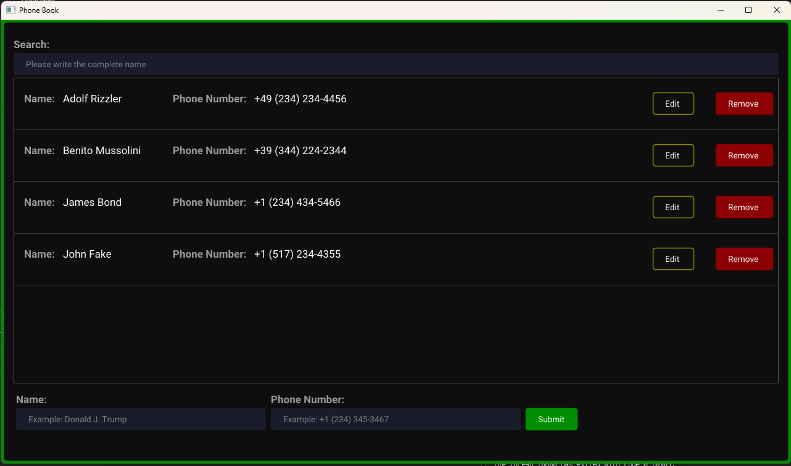
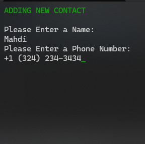
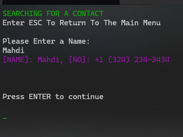
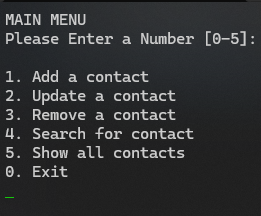
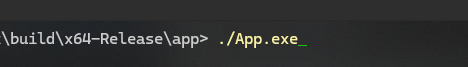
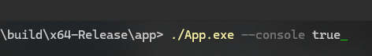

# Phone Book (University Project)

Phone Book was supposed to be a console based application that was taken further to have
ac actual GUI using ImGui.

> [!NOTE]
> I used OpenGL3 and GLFW to make it cross-platform but gui version of application
**IS NOT TESTED ON LINUX**

The stack used in this applicatin:
* CMAKE - build system
* C++   - Main Language
* ImGui - for GUI

Gui Preview:<br/>


Console Preview:<br/>





## Running the application

### WINDOWS
Install any IDE you want (preferably Visual Studio 2026).
Open the root folder in the IDE and build the CMakeLists.txt in the root directory and hit
CTRL + F7 in main.cpp in App to compile and build the exe 

To run the GUI application you can simply go to `build/x64-Release/app/` and run App.exe
or you can open the terminal go to the same direction and type `./App.exe`.<br/>


To run the application with console user interface you can run `./App.exe --console true`. <br/>


### LINUX
> [!IMPORTANT]
> Again the GUI application is not tested on Linux

First you need to compile the code:<br/>
Install a CMake, compiler and generator:<br/>
```BASH
sudo apt update
sudo apt install cmake g++ build-essential

# Check installation
cmake --version
g++ --version
make --version

```
Go to the project directory using Command Line</br>
```BASH
cd /project

# remove build folder
rm -rf build 

# Build the project
cmake -G "Unix Makefiles" -B build

cmake --build ./build -j$(nproc)

```

then run the application:

```BASH
# Since I don't have linux installed I can't tell the exact path

./build/${Path}/App

# OR for console experience

./build/${Path}/App --console true
```

## Structure

`/vendor`: contains all the dependencies like GLFW, GLAD and ImGui<br/>
`/gui`: contains all ImGui related code for GUI<br/>
`/app`: contains the logic of the application

files:<br/>
`/app/conact.hpp`: the contact node that is used to save the contact info<br/>
`/app/phoneBook.hpp`: phone book CRUD logic with BST algorithm (No recursion used).<br/>
`/app/consoleGui.hpp`: logics for console-based gui<br/>

`/gui/components.hpp`: all ImGui custom components is here<br/>
`/gui/gui.hpp`: main gui logic (initialization, rendering ...) <br/>


### Project Structure:

* Dependencies:<br/>
imgui<br/>
glad<br/>
GLFW3<br/>

- Main App:<br/>
Core - All the logic including phoneBook, Contact and console Gui<br/>
App  - contains the main function<br/>
Gui  - ImGui related code for Gui<br/>